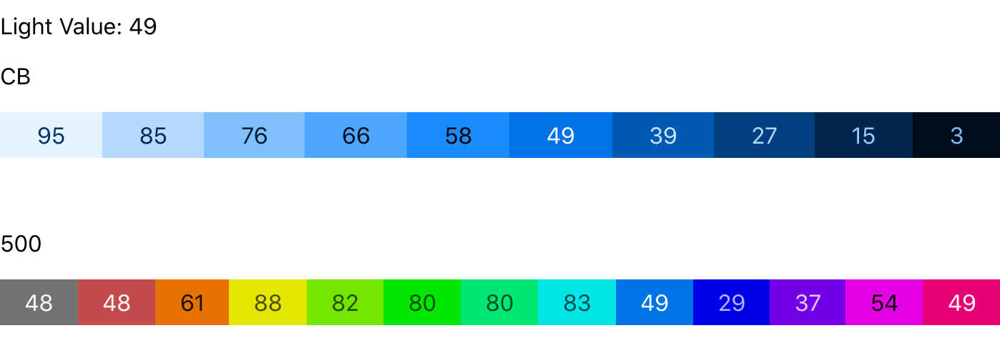

# Color Palette with Contrast Ratios

This project came around after learning React, and improved upon once learning GraphQL and Typescript. It's still a working progress, 

## The Problem

With modern standards, it's important to keep [A11y](https://www.a11yproject.com/) and accessibility in mind, where businesses are [held accountable](https://www.bbc.co.uk/news/technology-46894463) by the fringe users and those with accessibility needs such as screen readers and color blindness. Not everyone may agree with WCAG strict standards, however, when the company is held to a [high standard](https://technology.blog.gov.uk/2020/02/24/why-the-gov-uk-design-system-team-changed-the-input-type-for-numbers/), they're a must. This should be a factor from day one, not a refactor down the pipeline.

---
Specifically with color, different color spaces are represented unequally;
* Hex or RGB is representational of the 3 different splits of light
* HSL is broken into the Color Wheel, and tint/shade.
* CIE-Lab is built on perceived brightness, with _a_ and _b_ being a gradient of green -> red, and blue -> yellow respectively. However, this can also lead to 'impossible' colors, so it's best not to edit color in this space, only use for evaluation

## A Solution

Many interactions are met by aria data labels that help describe the website and increase accessibility. Art, Design, and for that - color - is subjective. Hues and shades have different brand indentity and meaning. With dark mode a prodominent feature, it introduces alterations to suite a darker background. However, you can't simply inverse the lightness, it can look garish. The key is perceived lightness (CIE-Lab color space) and being able to work with color that's interchangable of hue.

## What this app is

It's designed in mind with creating colors based on shades and ability to change those to align with the rest of your palette. This _desktop_ app is the step after creativty; to create a palette that means you can interchange your yellows and your blues and everything inbetween, having the security that you won't have contrast issues on your site. HEX or RGB is hard to read without color theory, HSL is inaccurate in it's representation. 

## How to use it

After adding a new palette, and shades based on a single hex color, select a color block and begin editing!

The idea is to bring granular controls (in HSL color space) to align each color together; across the hues for equal lightness, and across the shades for even distrubution.

The two 'gradients' bring to light that even in HSL where the L stands for `lightness`, color hues are not equal in perceived lightness, nor are they linear. Greens are bight, where blues are dark, and the closer to white colors become, their lightness is increased exponentially. This means that in use, you have to adjust or tweek your palettes to bring them together. However, once they're aligned, you will be able to use colors in convidence. 

> With HSL, both Saturation and Lightness affects it's lightness value, and so that's why there's granular control. As the creator, you can choose whether to soften/harden the saturation or lighten/darken the lightness to get to respective value.

(__Not Yet Implemented__)

After you're happy with the palette, they can be downloaded for sketch (a design app) or copied as CSS Custom Variables. The CSS will be copied in the pattern:

`--[Color-Label]-[Shade-Label]: hsl(x,x%,x%)` 

For the above example, this would translate to: `--CB-500: hsl(217, 72%, 53%)`

---

# Roadmap

- [ ] Design a mobile friendly version (Though, this is an edge case)
- [ ] Implement Server-Side State with login credentials
- [ ] Long-press on editor fields
- [ ] Create download file / Copy CSS Custom Variables from State
- [ ] Better Tests (I'm still new to testing everything, but I'm getting better)

This project was bootstrapped with [Create React App](https://github.com/facebook/create-react-app).